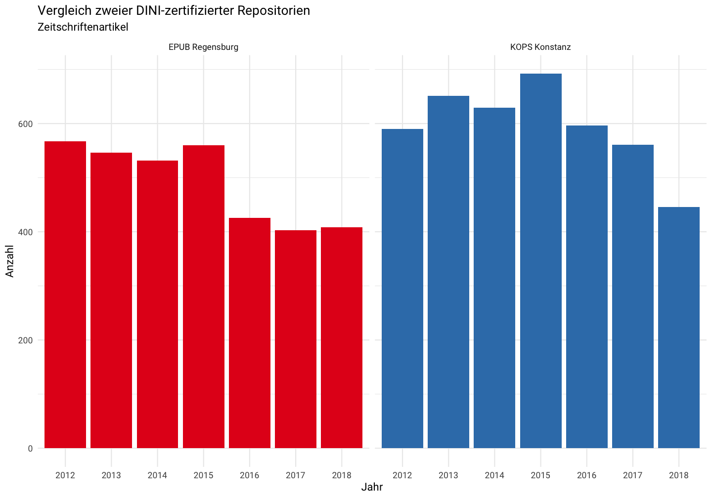

**Die Dokumentation und Demo kann als Notebook  im Browser selbst ausgeführt und verändert werden. Es befindet sich in der folgenden Cloud-basierten R Studio Session: <https://rstudio.cloud/project/272684>. Eine kostenfreie Anmeldung für den Dienst per Email ist notwendig. Wenn das Notebook lokal betrieben werden soll, bitte die Datei [oai_mit_R.Rmd] in R Studio verwenden!**

## Was ist R?

[R](https://cran.r-project.org/) ist eine freie und quelloffene statistische Programmierumgebung (nicht nur) für Datenanalysen.

Eine populäre R-Entwicklungsumgebung ist [R Studio](https://www.rstudio.com/). Wenn R und R Studio zunächst nicht installiert werden sollen, eignet sich die [R Studio Cloudversion](https://rstudio.cloud/) zum Ausprobieren.

Einige Merkmale von R:

- Es gibt umfangreichen Pakete, die zumeist im [Softwarearchiv CRAN](https://cran.r-project.org/web/packages/available_packages_by_name.html) vorgehalten werden. Viele Pakete fungieren als Schnittstellen zu Softwarepakten aus anderen Programmiersprachen, z.B. [Tesseract OCR](https://cran.r-project.org/web/packages/tesseract/index.html) oder [libcurl](https://cran.r-project.org/web/packages/curl/index.html). Für das Arbeiten mit wissenschaftlichen Quellen und Tools betreut die [rOpenSci](https://ropensci.org/packages/) umfangreiche Pakete.
- R Code kann interaktiv, als Skript oder mit Notebooks wie [Jupyter Notebooks](https://docs.anaconda.com/anaconda/navigator/tutorials/r-lang/) oder [R Markdown](https://rmarkdown.rstudio.com/) ausgeführt werden
- R Markdown lässt sich in verschiedene Formate wie docx, html oder pdf exportieren. Es lassen sich auch interaktive Dashboards mithilfe des Pakets [`flexdashboard`](https://rmarkdown.rstudio.com/flexdashboard/) aus R Markdown Dokumenten heraus erstellen
- R interoperiert mit vielfältigen Tools, um die Reproduzierbarkeit von Datenanalysen zu gewährleisten (siehe z.B. [A guide to modern reproducible data science with R - Karthik Ram](https://resources.rstudio.com/rstudio-conf-2019/a-guide-to-modern-reproducible-data-science-with-r))

## Pakete für OAI-PMH

Es gibt zwei Pakete zum Umgang mit OAI-PMH-Schnittstellen:

- [OAIHarvester: Harvest Metadata Using OAI-PMH Version 2.0](https://cran.r-project.org/web/packages/OAIHarvester/index.html) von Kurt Hornik. Das Paket verfügt über eine sehr umfangreiches [Tutorial am Beispiel des Insitutionellen Repositoriums der WU Wien](https://cran.r-project.org/web/packages/OAIHarvester/vignettes/oaih.pdf)
- [oai](https://cran.r-project.org/web/packages/oai/index.html) von Scott Chamberlain für die rOpenSci Initiative.

Für die folgende Demo nutzen wir [oai](https://cran.r-project.org/web/packages/oai/index.html) 

## Wie kann ich R lernen?

Es gibt vielfältige Möglichkeiten, R zu lernen. So bieten viele Universitäten Einsteigerkurse für R an.

Eine tolle und umfangreiche Einführung bietet
[R for Data Science](https://www.oreilly.com/library/view/r-for-data/9781491910382/) von Garrett Grolemund und Hadley Wickham. Das Buch einschließlich sämtlicher Codebeispiele ist Open Access verfügbar: <https://r4ds.had.co.nz/>


## Wie kann ich ein R Paket installieren?

Mit der Funktion `install.packages()`

```r
install.packages("oai")
```

## OAI am Beispiel des `oai` Pakets

Bibliothek laden:


```r
library(oai)
```

### Identify

Beispiel: KOPS der UNI Konstanz


```r
oai::id(url = "http://kops.uni-konstanz.de/oai/dini")
```

```
##   repositoryName                               baseURL protocolVersion
## 1           KOPS https://kops.uni-konstanz.de/oai/dini             2.0
##                       adminEmail    earliestDatestamp deletedRecord
## 1 arno.scharmann@uni-konstanz.de 2011-03-22T17:31:35Z     transient
##            granularity
## 1 YYYY-MM-DDThh:mm:ssZ
##                                                       description
## 1 oaikops.uni-konstanz.de:oai:kops.uni-konstanz.de:123456789/1234
```

### ListSets


```r
oai::list_sets(url = "http://kops.uni-konstanz.de/oai/dini")
```

```
## # A tibble: 173 x 2
##    setSpec         setName                        
##    <chr>           <chr>                          
##  1 ddc:920         Biography, genealogy, insignia 
##  2 ddc:800         Literature & rhetoric          
##  3 doc-type:report Report                         
##  4 ddc:090         Manuscripts & rare books       
##  5 ddc:370         Education                      
##  6 ddc:491.8       Slavic languages               
##  7 ddc:130         Paranormal phenomena           
##  8 ddc:490         Other languages                
##  9 ddc:650         Management & auxiliary services
## 10 ddc:010         Bibliography                   
## # ... with 163 more rows
```

### ListMetadataFormats


```r
oai::list_metadataformats(url = "http://kops.uni-konstanz.de/oai/dini")
```

```
##   metadataPrefix                                         schema
## 1         oai_dc http://www.openarchives.org/OAI/2.0/oai_dc.xsd
##                             metadataNamespace
## 1 http://www.openarchives.org/OAI/2.0/oai_dc/
```

`oai` wandelt das standardmäßige Format `oai_dc` in ein `data.frame`, ein tabellarisches Datenobjekt, um. R kennt darüber hinaus weitere Datenobjekte. Ebenso können Daten verschiedener Formate wie csv, xlsx, json, xml, yaml o.ä. in R importiert bzw. exportiert werden. 

In unserem Falle bleiben wir beim `oai_dc` Format, dass durch das `oai` Paket in ein `data.frame` transformiert wird. Es sind also keine XML-Kenntnisse notwendig, um Daten aus OAI-Schnittstellen zu gewinnen.

### ListIdentifiers


```r
oai::list_identifiers(url = "http://kops.uni-konstanz.de/oai/dini",
                      from = '2018-05-01T', until = '2018-06-01T')
```

```
## # A tibble: 175 x 11
##    identifier   datestamp  setSpec setSpec.1 setSpec.2 setSpec.3 setSpec.4
##    <chr>        <chr>      <chr>   <chr>     <chr>     <chr>     <chr>    
##  1 oai:kops.un… 2018-05-3… com_12… col_1234… doc-type… doc-type… open_acc…
##  2 oai:kops.un… 2018-05-1… com_12… col_1234… doc-type… doc-type… open_acc…
##  3 oai:kops.un… 2018-05-0… com_12… col_1234… doc-type… doc-type… open_acc…
##  4 oai:kops.un… 2018-05-0… com_12… com_1234… com_1234… col_1234… col_1234…
##  5 oai:kops.un… 2018-05-1… com_12… col_1234… doc-type… doc-type… open_acc…
##  6 oai:kops.un… 2018-05-1… com_12… col_1234… doc-type… ddc:004   doc-type…
##  7 oai:kops.un… 2018-05-0… com_12… com_1234… col_1234… col_1234… doc-type…
##  8 oai:kops.un… 2018-05-0… com_12… col_1234… ddc:530   doc-type… open_acc…
##  9 oai:kops.un… 2018-05-2… com_12… col_1234… ddc:004   doc-type… open_acc…
## 10 oai:kops.un… 2018-05-0… com_12… col_1234… doc-type… doc-type… open_acc…
## # ... with 165 more rows, and 4 more variables: setSpec.5 <chr>,
## #   setSpec.6 <chr>, setSpec.7 <chr>, setSpec.8 <chr>
```

### ListRecords


```r
oai::list_records(url = "http://kops.uni-konstanz.de/oai/dini",
                      from = '2018-05-01T', until = '2018-06-01T',
                  set = "doc-type:article")
```

```
## # A tibble: 109 x 136
##    identifier   datestamp  setSpec setSpec.1 setSpec.2 setSpec.3 setSpec.4
##    <chr>        <chr>      <chr>   <chr>     <chr>     <chr>     <chr>    
##  1 oai:kops.un… 2018-05-3… com_12… col_1234… doc-type… doc-type… open_acc…
##  2 oai:kops.un… 2018-05-1… com_12… col_1234… doc-type… doc-type… open_acc…
##  3 oai:kops.un… 2018-05-0… com_12… col_1234… doc-type… doc-type… open_acc…
##  4 oai:kops.un… 2018-05-1… com_12… col_1234… doc-type… doc-type… open_acc…
##  5 oai:kops.un… 2018-05-1… com_12… col_1234… doc-type… ddc:004   doc-type…
##  6 oai:kops.un… 2018-05-0… com_12… com_1234… col_1234… col_1234… doc-type…
##  7 oai:kops.un… 2018-05-0… com_12… col_1234… doc-type… doc-type… open_acc…
##  8 oai:kops.un… 2018-05-0… com_12… col_1234… doc-type… doc-type… open_acc…
##  9 oai:kops.un… 2018-05-0… com_12… col_1234… doc-type… doc-type… open_acc…
## 10 oai:kops.un… 2018-05-1… com_12… com_1234… col_1234… col_1234… doc-type…
## # ... with 99 more rows, and 129 more variables: setSpec.5 <chr>,
## #   title <chr>, creator <chr>, creator.1 <chr>, creator.2 <chr>,
## #   creator.3 <chr>, subject <chr>, description <chr>,
## #   description.1 <chr>, date <chr>, type <chr>, type.1 <chr>,
## #   identifier.4 <chr>, source <chr>, identifier.1 <chr>,
## #   identifier.2 <chr>, identifier.3 <chr>, language <chr>, rights <chr>,
## #   format <chr>, format.1 <chr>, creator.4 <chr>, creator.5 <chr>,
## #   creator.6 <chr>, creator.7 <chr>, creator.8 <chr>, creator.9 <chr>,
## #   subject.1 <chr>, subject.2 <chr>, subject.3 <chr>, subject.4 <chr>,
## #   subject.5 <chr>, subject.6 <chr>, format.2 <chr>, setSpec.6 <chr>,
## #   setSpec.7 <chr>, creator.10 <chr>, title.1 <chr>, creator.11 <chr>,
## #   creator.12 <chr>, creator.13 <chr>, creator.14 <chr>,
## #   creator.15 <chr>, creator.16 <chr>, creator.17 <chr>,
## #   creator.18 <chr>, creator.19 <chr>, creator.20 <chr>,
## #   creator.21 <chr>, creator.22 <chr>, creator.23 <chr>,
## #   creator.24 <chr>, creator.25 <chr>, creator.26 <chr>,
## #   creator.27 <chr>, creator.28 <chr>, creator.29 <chr>,
## #   creator.30 <chr>, creator.31 <chr>, creator.32 <chr>,
## #   creator.33 <chr>, creator.34 <chr>, creator.35 <chr>,
## #   creator.36 <chr>, creator.37 <chr>, creator.38 <chr>,
## #   creator.39 <chr>, creator.40 <chr>, creator.41 <chr>,
## #   creator.42 <chr>, creator.43 <chr>, creator.44 <chr>,
## #   creator.45 <chr>, creator.46 <chr>, creator.47 <chr>,
## #   creator.48 <chr>, creator.49 <chr>, creator.50 <chr>,
## #   creator.51 <chr>, creator.52 <chr>, creator.53 <chr>,
## #   creator.54 <chr>, creator.55 <chr>, creator.56 <chr>,
## #   creator.57 <chr>, creator.58 <chr>, creator.59 <chr>,
## #   creator.60 <chr>, creator.61 <chr>, creator.62 <chr>,
## #   creator.63 <chr>, creator.64 <chr>, creator.65 <chr>,
## #   creator.66 <chr>, creator.67 <chr>, creator.68 <chr>,
## #   creator.69 <chr>, creator.70 <chr>, creator.71 <chr>,
## #   creator.72 <chr>, …
```

Um OAI Records als csv-Tabelle zu sichern, sichern wir die Ergebnisse zunächst als ein Datenobjekt `my_df` und exportieren es anschließend mit der Funktion `write.csv`


```r
my_df <- oai::list_records(url = "http://kops.uni-konstanz.de/oai/dini",
                      from = '2018-05-01T', until = '2018-06-01T',
                  set = "doc-type:article")
write.csv(my_df, "meine_oai_dc_daten.csv")
```

### GetRecords


```r
oai::get_records(url = "http://kops.uni-konstanz.de/oai/dini",
                 ids = "oai:kops.uni-konstanz.de:123456789/8897")
```

```
## $`oai:kops.uni-konstanz.de:123456789/8897`
## $`oai:kops.uni-konstanz.de:123456789/8897`$header
## # A tibble: 1 x 3
##   identifier                              datestamp            setSpec    
##   <chr>                                   <chr>                <chr>      
## 1 oai:kops.uni-konstanz.de:123456789/8897 2018-01-30T13:52:12Z com_123456…
## 
## $`oai:kops.uni-konstanz.de:123456789/8897`$metadata
## # A tibble: 1 x 11
##   title creator subject description date  type  identifier source language
##   <chr> <chr>   <chr>   <chr>       <chr> <chr> <chr>      <chr>  <chr>   
## 1 Hydr… Hermin… Wettin… Optical ex… 1997  doc-… http://nb… Annal… eng     
## # ... with 2 more variables: rights <chr>, format <chr>
```

## Beispielanalyse

Das DINI-Zertifikat fordert die Verwendung kontrollierter Vokabulare für Publikationstypen und inhaltliche Erschließung mittels der Dewey-Dezimalklassifikation. Wir wollen uns diese Standardisierungsbemühungen zu nutze machen und die inhaltliche Verteilung von Artikeln zwischen der Universität Regensburg und der Universität Konstanz  analysieren.


```r
konstanz <- oai::list_records(url = "http://kops.uni-konstanz.de/oai/dini",
                  set = "doc-type:article")
uni_reg <- oai::list_records(url = "http://epub.uni-regensburg.de/cgi/oai2",
                  set = "doc-type:article")
```

Wir interessieren uns für folgende Dublin-Core-Felder: `subject`, `title`, `rights`, `date`, die wir mit der Funktion [`select`](https://dplyr.tidyverse.org/reference/select.html) auswählen.


```r
library(tidyverse)
konstanz_short <- konstanz %>%
  select(contains("subject"), contains("date"), 
         contains("title"), contains("rights")) %>%
  mutate(source = "KOPS Konstanz")
uni_reg_short <- uni_reg %>%
  select(contains("subject"), contains("date"), 
         contains("title"), contains("rights")) %>%
  mutate(source = "EPUB Regensburg")
# combine it into one data.frame
my_df <- bind_rows(konstanz_short, uni_reg_short)
```

## Verteilung nach Jahr

Mithilfe des Pakets [`lubridate`](https://lubridate.tidyverse.org/) transformieren wir die Datumsangaben als Jahr. Anschließend wählen wir nur Records zwischen 2012 und 2018 mit der Funktion[`filter()`](https://dplyr.tidyverse.org/reference/filter.html) und berechnen das gemeinsame Vorkommen von Artikeln je Jahr und Quelle mit [`count`](https://dplyr.tidyverse.org/reference/tally.html). Zur Visualiserung nutzen wir [ggplot2](https://ggplot2.tidyverse.org/).


```r
my_df %>%
  mutate(year = lubridate::parse_date_time(date, c('y', 'ymd', 'ym'))) %>%
  mutate(year = lubridate::year(year)) %>%
  filter( year > 2011, year < 2019) %>%
  count(year, source) %>%
  ggplot2::ggplot(aes(as.character(year), n, fill = source)) +
  geom_bar(stat = "identity") +
  facet_wrap(~source) +
  guides(fill=FALSE) +
  scale_fill_brewer(palette = "Set1") +
  theme_minimal(base_family = "Roboto") +
  labs(x = "Jahr", y = "Anzahl", title = "Vergleich zweier DINI-zertifizierter Repositorien", subtitle = "Zeitschriftenartikel")
```



## Wie viele davon sind frei verfügbar?


```r
my_df %>%
  mutate(license = ifelse(!is.na(rights), "OA", "Closed")) %>%
  mutate(year = lubridate::parse_date_time(date, c('y', 'ymd', 'ym'))) %>%
  mutate(year = lubridate::year(year)) %>%
  filter( year > 2011, year < 2019) %>%
  count(year, source, license) %>%
  ggplot2::ggplot(aes(as.character(year), n, fill = license)) +
  geom_bar(stat = "identity") +
  facet_wrap(~source) +
  theme(legend.position="top") +
  scale_fill_manual(values = c("#b3b3b3a0", "#56B4E9"), name = "OA Rechte") +
  theme_minimal(base_family = "Roboto") +
  theme(legend.position = "top",
          legend.justification = "right") +
  labs(x = "Jahr", y = "Anzahl", title = "Zeitschriftenartikel in DINI-zertifizierten Repositorien")
```


## Fachliche Verteilung der Artikel

Das Paket [`tidyr`](https://tidyr.tidyverse.org/) bietet Werkzeuge, um etwa Tabellen von einem weiten zu einem langen Format zu transformieren.


```r
my_df %>%
  mutate(license = ifelse(!is.na(rights), "OA", "Closed")) %>%
  mutate(year = lubridate::parse_date_time(date, c('y', 'ymd', 'ym'))) %>%
  mutate(year = lubridate::year(year)) %>%
  filter( year > 2011, year < 2019) %>%
  gather(contains("subject"), key = "subject_xml_node", value = "subject") %>% select(date, title, license, year, subject, subject_xml_node, source) %>% 
  # filter for ddc values 
  filter(str_detect(subject, "ddc")) %>%
  # aggregate
  group_by(subject, source) %>%
  summarise(n = n()) %>% 
  ungroup() %>%
  group_by(source) %>%
  top_n(10) %>%
  ungroup() %>%
  arrange(source, n) %>%
  mutate(order = row_number()) -> tt
```

```
## Selecting by n
```

```r
  ggplot(tt, aes(order, n, fill = source)) +
  geom_bar(stat = "identity", show.legend = FALSE) +
  facet_wrap(~source, scales = "free_y", ncol = 2) +
  # Add categories to axis
  scale_x_continuous(
    breaks = tt$order,
    labels = tt$subject,
    expand = c(0,0)
  ) +
  coord_flip() +
    scale_fill_brewer(palette = "Set1") +
    theme_minimal("Roboto", base_size = 12) +
    theme(panel.grid.major.y = element_blank()) +
    theme(panel.grid.minor=element_blank()) +
    labs(y = "Anzahl Artikel", x = "dc:subject (DDC)",
         title = "Vergleich zweier DINI-zertifizierter Repositorien", subtitle = "Fachliche Verteilung Zeitschriftenartikel (2012 - 2018)") 
```


